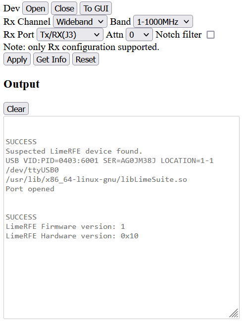

# LimeRFE Control (limerfectl)
limerfectl is a webserver that allows you to configure the LimeRFE remotely over a network. In my setup, I have a Raspberry Pi connected to the LimeRFE via USB running the limerfectl webserver.


<p align="middle">

</p>


## Usage
```
limerfectl run --help
Usage: limerfectl run [OPTIONS]

  Launches the limerfectl webserver

Options:
  -p, --port TEXT  Network port to bind to    
  -a, --addr TEXT  Network address to bind to 
  --help           Show this message and exit.
```

Defaults to 127.0.0.1:8000
```
limerfectl run 
[2023-02-26 17:30:06 +1100] [3641] [INFO] Starting gunicorn 20.1.0
[2023-02-26 17:30:06 +1100] [3641] [INFO] Listening at: http://127.0.0.1:8000 (3641)
[2023-02-26 17:30:06 +1100] [3641] [INFO] Using worker: sync
[2023-02-26 17:30:06 +1100] [3643] [INFO] Booting worker with pid: 3643
```

or you can bind it to an address and port:
```
limerfectl run -a 0.0.0.0 -p 8080
[2023-02-26 17:31:28 +1100] [3656] [INFO] Starting gunicorn 20.1.0
[2023-02-26 17:31:28 +1100] [3656] [INFO] Listening at: http://0.0.0.0:8080 (3656)
[2023-02-26 17:31:28 +1100] [3656] [INFO] Using worker: sync
[2023-02-26 17:31:28 +1100] [3658] [INFO] Booting worker with pid: 3658
```

## How to install

### What you will need
```
 sudo apt install liblimesuite-dev python3 python3-virtualenv python3-pip
```

### Install
```
git clone https://github.com/engineerang/limeRFEctl.git 
cd limeRFEctl
python -m venv -m .env
source .env/bin/activate
pip install -e .
```

### Windows Subsystem Linux

If using WSL some additional steps are required:

- Follow install instructions here: https://devblogs.microsoft.com/commandline/connecting-usb-devices-to-wsl/
- Open CMD as Administrator
  
```
usbipd wsl list
usbipd wsl attach --busid <limerfe busid>
```

- open WSL
```
sudo chmod 666 /dev/ttyUSB<limerfe id>
```
